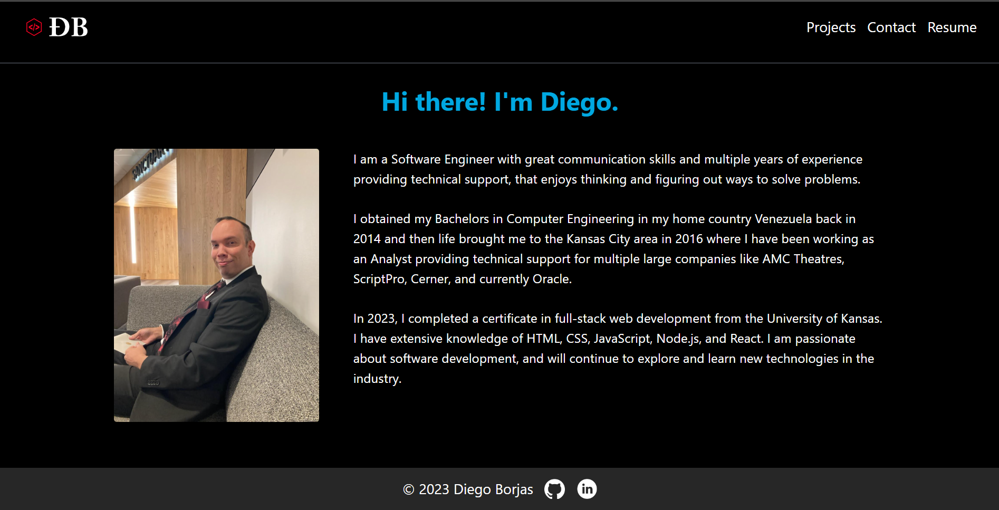
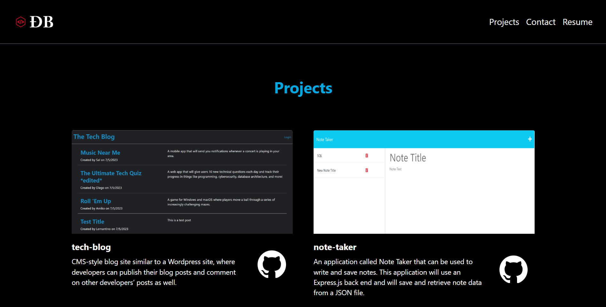
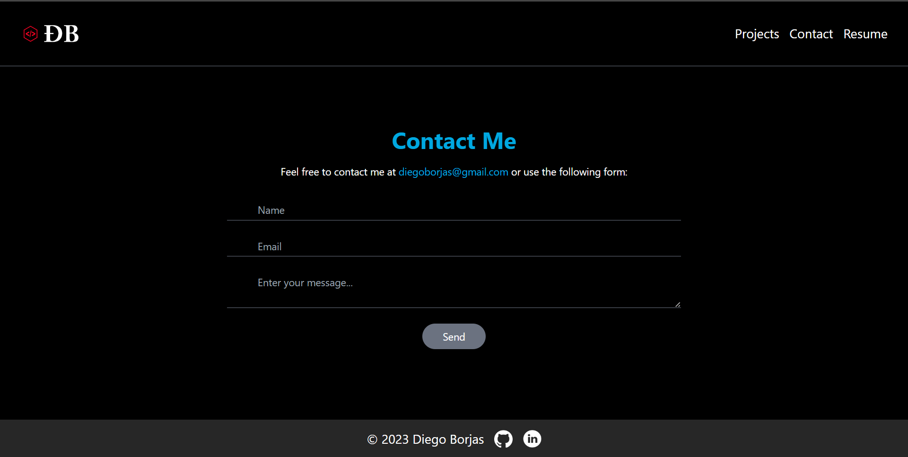

# React Portfolio

## Table of Contents

- [Description](#description)
- [Technology](#Technology)
- [Installation](#installation)
- [Usage](#usage)
- [License](#license)
- [Questions](#questions)

## Description:

This is my first React porfolio. It includes a homepage with the introduction of myself, my projects, a way to contact me, and my resume.

## Technology:

Project is created with:

- React.js
- Javascript
- Tailwind

## Installation

To run this project, install it locally using npm:

```
npm install
```

## Usage

After installing npm packages, the application will be invoked by using the following command:

```
npm run dev
```


#### Portfolio Screenshot





## License

[](https://opensource.org/licenses/MIT) <br>
This project is licensed under MIT, for more information please visit [this website](https://opensource.org/licenses/MIT)

## Questions?

Please feel free to contact me if you need any further information:

- [Email](mailto:diegoborjas@gmail.com)
- [Github Profile](https://github.com/DiegoABorjas)